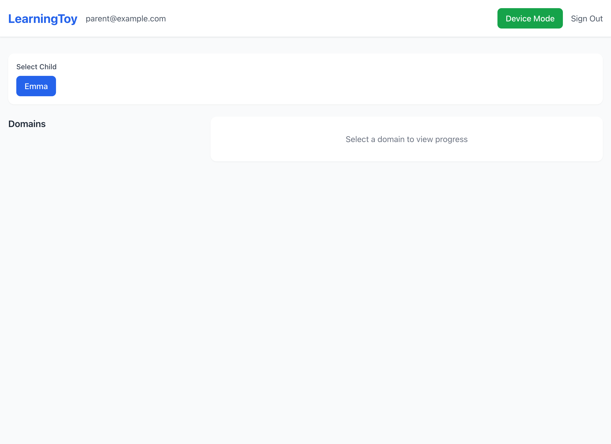

# LearningToy

A multilingual language learning platform for children with a web-based device emulator, backend API, and parent dashboard.

## Screenshots

### Login Page


### Parent Dashboard


### Device Emulator


## Features

- **Device Emulator**: Web-based simulation of a physical learning device with screen and text chat
- **Learning Graph**: Progressive word learning from simple to advanced concepts
- **Parent Dashboard**: Track progress, view domain graphs, and manage vocabulary
- **Multilingual**: Built-in support for English, Polish, and Spanish

## Tech Stack

### Backend
- FastAPI (Python 3.11+)
- PostgreSQL 15
- SQLAlchemy 2.0 (async)
- Alembic (migrations)
- JWT authentication

### Frontend
- React 18 + Vite
- TypeScript
- Tailwind CSS
- Zustand (state management)
- React Router

## Quick Start

### Option 1: Docker Compose (Recommended)

```bash
# Start all services
docker-compose up -d

# Seed the database with sample data
docker-compose exec backend python run_seed.py
```

Then visit:
- Frontend: http://localhost:5173
- Backend API: http://localhost:8000
- API Docs: http://localhost:8000/docs

### Option 2: Local Development

**Backend:**
```bash
cd backend

# Create virtual environment
python -m venv venv
source venv/bin/activate  # On Windows: venv\Scripts\activate

# Install dependencies
pip install -r requirements.txt

# Copy environment file
cp .env.example .env

# Start PostgreSQL (using Docker)
docker run -d --name learningtoy-db \
  -e POSTGRES_USER=learningtoy \
  -e POSTGRES_PASSWORD=learningtoy \
  -e POSTGRES_DB=learningtoy \
  -p 5432:5432 \
  postgres:15-alpine

# Seed the database
python run_seed.py

# Run the server
uvicorn app.main:app --reload
```

**Frontend:**
```bash
cd frontend

# Install dependencies
npm install

# Start dev server
npm run dev
```

## Sample Data

The seed script creates two domains with learning graphs:

### Animals Domain
- **Beginner**: Dog, Cat, Bird, Fish
- **Intermediate**: Rabbit, Squirrel, Horse, Cow
- **Advanced**: Hedgehog, Fox, Owl

### Food & Home Domain
- **Beginner**: Apple, Bread, Milk, Water, Chair, Table
- **Intermediate**: Breakfast, Cheese, Kitchen
- **Advanced**: Refrigerator, Sandwich, Soup

## API Endpoints

### Authentication
- `POST /api/v1/auth/register` - Register new parent account
- `POST /api/v1/auth/login` - Login and receive JWT
- `GET /api/v1/auth/me` - Get current user info
- `GET /api/v1/auth/children` - List parent's children
- `POST /api/v1/auth/children` - Add child profile

### Domains
- `GET /api/v1/domains` - List all domains
- `GET /api/v1/domains/{id}` - Get domain details
- `GET /api/v1/domains/{id}/words` - Get all words in domain
- `GET /api/v1/domains/{id}/graph` - Get learning graph

### Progress
- `GET /api/v1/progress/child/{id}/overview` - Dashboard statistics
- `GET /api/v1/progress/child/{id}/next-words` - Get recommended words
- `POST /api/v1/progress/child/{id}/word/{word_id}/attempt` - Record practice attempt

### Chat
- `POST /api/v1/chat/message` - Send chat message, get AI response (mock)

## Project Structure

```
LearningToy/
├── backend/
│   ├── app/
│   │   ├── api/              # API route handlers
│   │   ├── models/           # SQLAlchemy models
│   │   ├── schemas/          # Pydantic schemas
│   │   ├── services/         # Business logic
│   │   └── db/seed.py        # Sample data
│   ├── alembic/              # Database migrations
│   └── requirements.txt
│
├── frontend/
│   ├── src/
│   │   ├── components/
│   │   │   ├── DeviceEmulator/   # Child device simulator
│   │   │   └── ParentDashboard/  # Parent interface
│   │   ├── services/         # API clients
│   │   ├── stores/           # Zustand state
│   │   └── pages/            # Page components
│   └── package.json
│
└── docker-compose.yml
```

## Development Roadmap

- [ ] Voice chat integration (OpenAI/Anthropic)
- [ ] ESP32 hardware device support
- [ ] More domains and vocabulary
- [ ] Gamification (streaks, badges)
- [ ] Sibling leaderboard
- [ ] Offline mode
